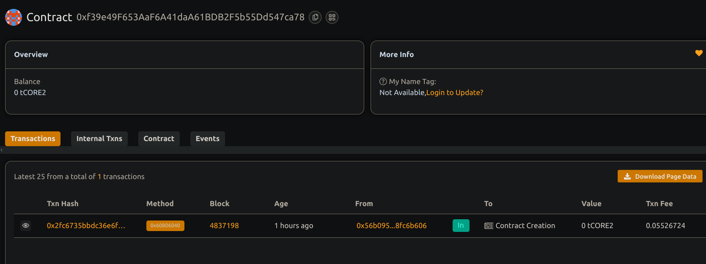

# Smart Contract Risk Insurance Protocol

## 📖 Project Description

This decentralized insurance protocol allows users to purchase policies against smart contract risks and submit claims in case of losses due to contract failures or exploits. The protocol provides a trustless, on-chain claim approval mechanism governed by the contract owner or Everyone can use.you can use this.

## 🌍 Project Vision

To build a transparent, permissionless, and efficient system that helps users hedge against on-chain risks by offering verifiable insurance cover.

## 🔑 Key Features

- Purchase insurance with ETH premium
- Policy coverage based on a fixed multiplier of the premium
- Claim submission and on-chain approval process
- Owner can approve or reject claims with reason
- Funds are paid out directly on claim approval

## 🚀 Future Scope

- DAO-based claim governance
- Integration with on-chain risk oracles (e.g., Chainlink)
- Tiered premiums based on contract risk scores
- Support for ERC20 premium and payouts
- Reinsurance and risk pool sharing

## Contract details
0xf39e49F653AaF6A41daA61BDB2F5b55Dd547ca78
